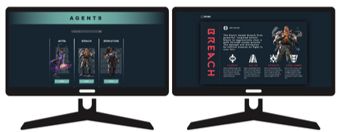

<h3 align="center">Valorant Agents</h3>

<div align="center">

  <a href="https://www.linkedin.com/in/leonardo-altemari-008a8017b/">
    
  </a>

  <a href="https://github.com/leoaltemari/tokenEvents-React/blob/master/LICENSE">
    
  </a>

</div>

---

### 📺 Preview:

This is an aplication to study and apply some concepts of React in a pratic project.
It is just a list of the agents of the game <a href="https://playvalorant.com/">Valorant</a>
and some data of each one.

The data is colect by the public <a href="https://dash.valorant-api.com/about">VALORANT API</a>.

<h3 align="center">
    
</h3>

---

### 🚀 Technologies

-   [React](https://react.dev/)
-   [React-router-dom](https://www.npmjs.com/package/react-router-dom)
-   [Typescript](https://www.typescriptlang.org/)
-   [Axios](https://www.npmjs.com/package/axios)
-   [HTML 5](https://developer.mozilla.org/pt-BR/docs/Web/HTML)
-   [Sass](https://sass-lang.com/)

---

### 🔥 How to install and setup the project

#### Pré-requisitos

-   It is <strong>necessary</strong> to have installed in your machine the [Node.js](https://nodejs.org/en/).
-   The project was developed using the NPM package manager.

##### 1º ⏩ Clone the repository

```sh
  $ git clone https://github.com/leoaltemari/valorant-agensts-display.git
```

##### 2º ⏩ Enter the project folder

```sh
  $ cd .\valorant-agensts-display\
```

##### 3º ⏩ Install the dependencies and run the project

```sh
  $ npm install
```

```sh
  # Open the server that will be running.
  $ npm run dev
```

---

### 🔐 License

This project is licensed under the MIT license. See the [LICENSE](LICENSE) file for more details.